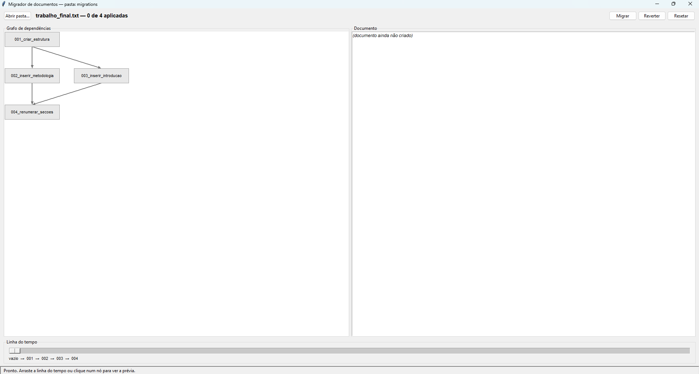
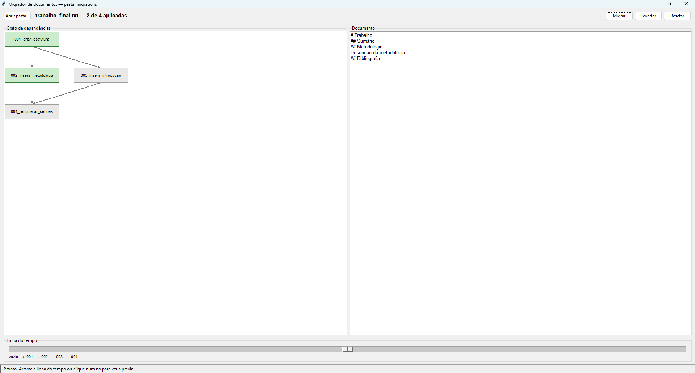
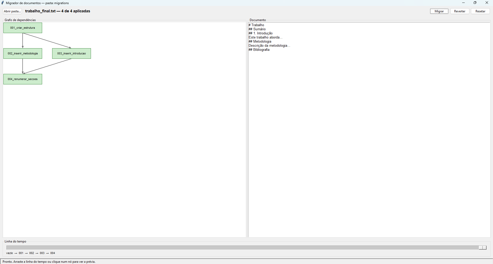

# Sistema de Migrations para Documentos `.txt` com Grafo de Dependências

Número da Dupla: 17
Conteúdo da Disciplina: Grafos

## Alunos

| Matricula | Aluno                      |
| --------- | -------------------------- |
| 211031682 | Davi Araújo Bady Casseb    |
| 221022506 | Cayo Felipe Alencar Câmara |

## Sobre

Este projeto implementa um aplicativo desktop em Python para gerenciar *migrations* de um documento de texto, onde cada alteração pode depender de outras. As dependências são modeladas como um grafo direcionado acíclico (DAG) e a ordem correta de aplicação é obtida por ordenação topológica.

O objetivo principal e permitir que estudantes compreendam o uso de grafos em um problema concreto, visualizando a construção do grafo de dependências, a ordenação topológica, a detecção de ciclos e a aplicação e reversão das alterações sobre o documento em tempo real. Uma *migration* é uma unidade de alteração identificada por um id único, com um campo `depends` que declara de quais outras ela depende, um bloco `up` que aplica a mudança e um bloco `down` que a reverte. A ordem de aplicação **não** vem do número no nome do arquivo (que é apenas rótulo), e sim exclusivamente das dependências declaradas.

Funcionalidades:
* Visualizacao grafica do grafo de dependências utilizando Tkinter
* Layout em camadas por nível (maior caminho desde uma raiz)
* Ordenação topológica das migrations pelo algoritmo de Kahn
* Detecção de ciclos, indicando quais migrations formam o ciclo
* Detecção de dependências inexistentes, listando o que falta
* Aplicação (migrar) e reversão (rollback) das alterações sobre o `.txt`
* Linha do tempo para navegar entre o estado vazio e todas aplicadas
* Destaque visual de cada migration por estado (aplicada, pendente, em ciclo)
* Prévia (diff) do que cada migration altera, com linhas que entram e saem
* Persistência do estado em arquivo para continuar de onde parou
* Núcleo desacoplado da interface, testável por terminal sem Tkinte

## Screenshots





## Instalação

Linguagem: Python
Framework: Tkinter
Pré-requisitos:
* Python 3.10+ instalado
* Tkinter disponível na instalação do Python
* Nenhuma dependência externa a instalar (apenas biblioteca padrão)

Comandos para executar:
```bash
python main.py
```
Para abrir com outra pasta de migrations (por exemplo, o conjunto com ciclo):
```bash
python main.py exemplos/ciclo
```
Para executar os testes do núcleo (sem interface):
```bash
python -m unittest discover -s testes
```
## Uso

Após iniciar o aplicativo:
1. Arraste a linha do tempo para aplicar ou reverter migrations e levar o documento a qualquer estado entre vazio e todas aplicadas
2. Clique em Migrar para aplicar todas as migrations pendentes na ordem correta
3. Utilize Reverter para desfazer um passo, executando o bloco `down`
4. Clique em Resetar para voltar ao estado inicial (documento vazio)
5. Clique em um nó do grafo para ver, no painel da direita, a prévia do que aquela migration altera
6. Observe as cores dos nós e a barra de status: verde indica aplicada, cinza pendente e vermelho envolvida em ciclo
7. Quando houver ciclo ou dependência inexistente, a operação de migrar fica bloqueada e o erro aparece na barra de status

### Formato de uma migration (`.mig`)

Cada migration é um arquivo de texto com um cabeçalho e os blocos `[up]` e `[down]`:
```
-- migration: 003_inserir_introducao
-- depends: 001_criar_estrutura

[up]
INSERIR_APOS "## Sumário" "## Introdução\nTexto..."

[down]
REMOVER_TEXTO "## Introdução\nTexto..."
```
O campo `-- migration:` (obrigatório) define o id único; `-- depends:` (opcional) lista os ids dos quais a migration depende, separados por vírgula. Os blocos `[up]` e `[down]` trazem um comando por linha, com argumentos sempre entre aspas duplas e escapes `\n`, `\"` e `\\`.

### Mini-linguagem de comandos

| Comando | Efeito |
| --- | --- |
| `CRIAR_ARQUIVO "<conteúdo>"` | Cria o documento com o conteúdo inicial |
| `REMOVER_ARQUIVO` | Apaga o documento |
| `INSERIR_APOS "<âncora>" "<texto>"` | Insere o texto após a primeira linha igual à âncora |
| `INSERIR_FIM "<texto>"` | Acrescenta o texto ao final |
| `REMOVER_TEXTO "<texto>"` | Remove a primeira ocorrência do texto |
| `SUBSTITUIR "<antigo>" "<novo>"` | Troca a primeira ocorrência de antigo por novo |

Cada `up` tem um `down` que o reverte: `INSERIR_APOS`/`INSERIR_FIM` são revertidos por `REMOVER_TEXTO`, `SUBSTITUIR` por outro `SUBSTITUIR` invertido, e `CRIAR_ARQUIVO` por `REMOVER_ARQUIVO`.

### Exemplos incluídos

* `exemplos/migrations/`: conjunto válido em formato de diamante — `002` e `003` dependem de `001`, e `004` depende de `002` e `003`
* `exemplos/ciclo/`: conjunto inválido (`a` depende de `b` e `b` depende de `a`) para demonstrar a detecção de ciclo
  
## Outros

### Arquitetura do Projeto

* `main.py`: ponto de entrada da aplicação
* `ui/app.py`: interface gráfica, controles e renderização do grafo
* `core/migrador.py`: orquestra carregamento, validação, ordenação e aplicação
* `core/grafo.py`: implementacao manual do grafo (adjacência, grau de entrada, Kahn, ciclo)
* `core/validador.py`: validação de dependências inexistentes e ciclos
* `core/executor.py`: motor de texto da mini-linguagem de comandos
* `core/parser.py`: leitura dos arquivos `.mig` em objetos Migration
* `core/estado.py`: persistência do estado em `.estado.json`
* `testes/test_grafo.py` e `testes/test_executor.py`: testes do núcleo
  
### Destaque Técnico

* Algoritmos de grafo implementados manualmente, sem biblioteca de grafos
* Lista de adjacência e grau de entrada próprios como representação do grafo
* Ordenação topológica de Kahn com saída determinística por fila de prioridade
* Detecção de ciclo obtida do próprio Kahn, sem algoritmo adicional
* Layout do grafo por caminho mais longo em um DAG
* Motor de texto puro e reversível, com diff por subsequência comum (LCS)
* Núcleo desacoplado da interface, testável sem Tkinter
### Demonstração
[Link do vídeo no YouTube](< # >)
